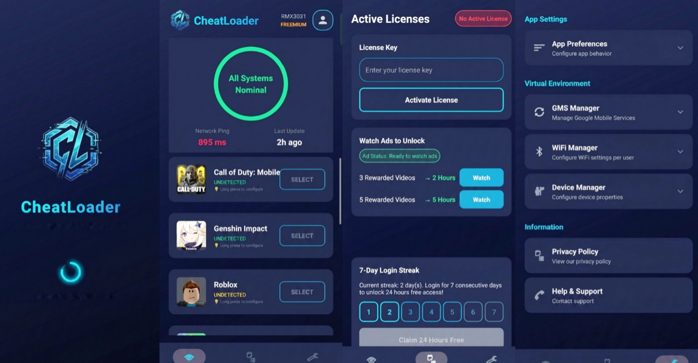

# CheatLoader - Advanced Gaming Utility & Modding Tool



[](https://github.com/RedZONERROR/CheatLoader/blob/main/LICENSE)
[](https://developer.android.com)
[](https://t.me/cheatloader)
[](https://github.com/RedZONERROR/CheatLoader)

## 🚀 What is CheatLoader?

CheatLoader is an advanced **gaming utility and modding tool** for Android that allows you to load custom code, libraries, and modifications at runtime. Run apps in secure, isolated container environments without requiring root access.

### ✨ Key Features

- **🔧 Custom Code Loading** - Inject and execute custom code at runtime
- **📚 Custom Libraries** - Load native (.so) and Java/Kotlin libraries dynamically
- **🔒 Container Environment** - Run apps in isolated, secure sandboxes
- **🛡️ Full Security** - Advanced security features protect your device
- **📱 Wide Compatibility** - Android API 26 (8.0) to API 36 (14+)
- **⚡ High Performance** - Optimized for speed and efficiency
- **🚫 No Root Required** - Works on non-rooted devices

## 📥 Download

Get the latest version from our [GitHub Releases](https://github.com/RedZONERROR/CheatLoader/releases/latest) page.

### System Requirements

- Android 8.0 (API 26) or higher
- ARM64 or ARMv7 processor
- At least 2GB RAM recommended
- 100MB free storage space

## 🎯 Use Cases

- **Game Modding** - Modify game behavior and add custom features
- **App Customization** - Customize any app's functionality
- **Development Testing** - Test code modifications without repackaging
- **Research & Learning** - Study app behavior and reverse engineering
- **Privacy Enhancement** - Run apps in isolated environments

## 🔧 How It Works

1. **Install CheatLoader** - Download and install on your Android device
2. **Load Your App** - Import the app you want to modify
3. **Add Custom Code** - Load your custom code, libraries, or mods
4. **Run & Enjoy** - Launch the app with your modifications

## 📖 Documentation

### Quick Start Guide

```bash
# 1. Download CheatLoader APK
# 2. Install on your Android device
# 3. Open CheatLoader
# 4. Import your target app
# 5. Load custom code/libraries
# 6. Launch and enjoy!
```

### Loading Custom Code

CheatLoader supports multiple ways to load custom code:

- **Java/Kotlin Classes** - Load .dex or .jar files
- **Native Libraries** - Load .so files for ARM/ARM64
- **Scripts** - Execute custom scripts at runtime
- **Hooks** - Hook into app methods and modify behavior

### Container Environment

Apps run in a secure, isolated container that provides:

- **File System Virtualization** - Isolated file system
- **Permission Management** - Granular permission control
- **Network Isolation** - Optional network sandboxing

## 🌐 Community

Join our vibrant community of developers and modders:

- **📢 Main Channel** - [@cheatloader](https://t.me/cheatloader) - Updates & Releases
- **💬 Official Chat** - [@cheatloaderofficial](https://t.me/cheatloaderofficial) - Discussions & Support
- **🏢 Studio Channel** - [@theredxstudio](https://t.me/theredxstudio) - Development Updates

## 🛠️ Technical Details

### Architecture

CheatLoader uses advanced virtualization techniques:

- **Dynamic Code Loading** - Runtime code injection
- **Native Hook Framework** - Low-level system hooks
- **Security Sandbox** - Multi-layer security protection

### Supported Formats

- **APK Files** - Standard Android packages
- **DEX Files** - Dalvik Executable format
- **JAR Files** - Java Archive files
- **SO Files** - Native shared libraries
- **Scripts** - Custom scripting support

## ⚠️ Disclaimer

CheatLoader is provided for **educational and research purposes only**. Users are responsible for complying with all applicable laws and terms of service. The developers are not responsible for any misuse of this tool.

### Ethical Use Guidelines

- ✅ Use for learning and research
- ✅ Test on your own apps
- ✅ Respect intellectual property
- ❌ Don't use for cheating in online games
- ❌ Don't violate terms of service
- ❌ Don't distribute modified apps

## 📄 License

CheatLoader is licensed under the MIT License. See [LICENSE](https://github.com/RedZONERROR/CheatLoader/blob/main/LICENSE) for details.

## 📞 Support

Need help? Here's how to get support:

1. **📖 Documentation** - Check our [Wiki](https://github.com/RedZONERROR/CheatLoader/wiki)
2. **💬 Telegram Chat** - Ask in [@cheatloaderofficial](https://t.me/cheatloaderofficial)
3. **🐛 Issues** - Report bugs on [GitHub Issues](https://github.com/RedZONERROR/CheatLoader/issues)

## 🌟 Acknowledgments

Special thanks to:

- The Android modding community
- Open source contributors
- Our amazing users and testers

---

<div align="center">

**Made with ❤️ by [TheRedXStudio](https://t.me/theredxstudio)**

[Website](https://redzonerror.github.io/CheatLoader/) • [Telegram](https://t.me/cheatloader) • [GitHub](https://github.com/RedZONERROR/CheatLoader)

</div>
